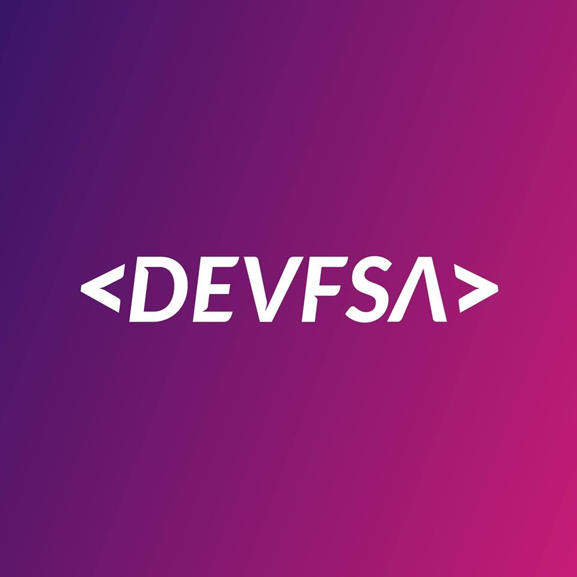

  

<h1 align="center">Fórum</h1>

:rocket: Nosso espaço para compartilhar conhecimento e tirar dúvidas através de issues.

## Diretrizes e Boas Práticas

Antes de criar uma issue, confira se você seguiu as diretrizes a seguir:

### Pesquise

Para que você tenha o melhor retorno em sua issue, faça uma pesquisa antes. Algumas de nossas dúvidas podem ser respondidas através de pesquisas simples em sistemas de buscas ou documentações. Caso não encontre uma resposta, lembre-se de trazer em sua issue a informação que encontrou e a que você está buscando.

#### Pesquise no fórum

1. Utilize a função de busca no topo desse repositório (certifique-se de não estar em um *fork*)

2. Verifique se já não existe uma issue respondida sobre o que você está buscando

#### Pesquise na internet

Dê preferência para resultados de documentações oficiais e fóruns especializados. Sites como o [StackOverflow](https://stackoverflow.com/) e [Mozilla Developer Network (MDN)](https://developer.mozilla.org/pt-BR/) podem ser úteis.

### Pontos adicionais

* Escreva o português de forma correta e bem pontuado.
* Evite sair do escopo inicial da issue. Caso necessário, crie uma nova issue e mencione o número da issue.
* Se precisar de ajuda em um código, é interessante dispor de trechos do código através de sites como [Gists](https://gist.github.com/), [Hastebin](https://hastebin.com/), [Pastebin](https://pastebin.com/) ou outro serviço parecido. É válido lembrar que ninguém tem a obrigação de resolver o problema apresentado na issue, então seja cordial e paciente.

## Como criar uma boa issue?

1. Faça um título claro e categorizado (utilizando as labels). Assim será mais fácil de filtrar as issues no repositório. Exemplo:
    - Trabalhar com JavaScript paga bem?

2. Vale lembrar que se sua issue for uma subcategoria e não possuir uma label, é necessário adicionar uma palavra-chave relacionada entre colchetes. Exemplo:
    - [Flask] Como trabalhar com migrations no Flask

3. Adicione uma label apropriada para sua issue

4. Caso seja uma dúvida, lembre-se de descrever o problema e o que você já tentou fazer para solucionar ele.

## Código de Conduta

Como qualquer grupo de discussões, existem algumas regras que devem ser seguidas para proporcionar uma melhor experiência à todos.

* Respeite para ser respeitado. Não escreva algo que possa ofender alguém. Reflita se o texto não é agressivo/mal educado antes de enviar.
* Mantenha as críticas nas idéias e não nas pessoas.
* Não será permitido qualquer tipo de assédio ou discriminação relacionados a características ou escolhas pessoais, bem como bullying, sexismo, racismo ou qualquer outro tipo de ação que possa proporcionar constrangimento aos outros participantes.

Comporte-se profissionalmente. Os participantes que violarem tais regras serão convidados a se retirar ou banidos dada a gravidade de suas ações.

## Repositórios do DevFSA

- [Fórum](https://github.com/devfsa/forum)
- [Eventos](https://github.com/devfsa/eventos)
- [Vagas](https://github.com/devfsa/vagas)
- [Meetups](https://github.com/devfsa/meetups)
